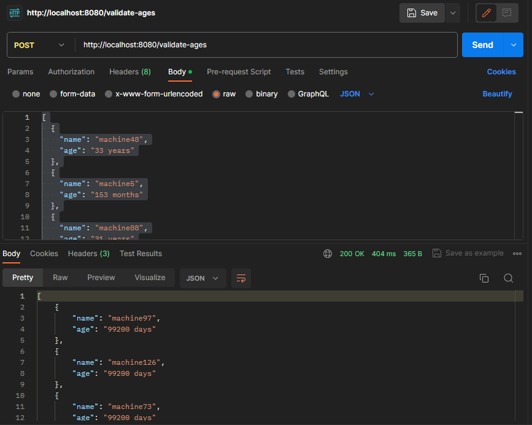
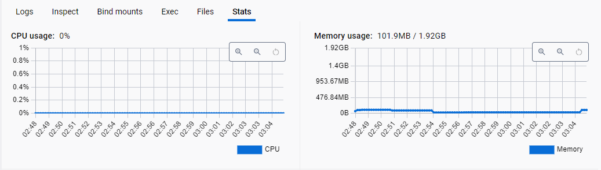

# outlier-detection

This project implements a a standalone REST micro service to validate a list of machine ages.

## Domain

The service expects input data in JSON format. 
The input should be an array of objects, 
where each object represents information about a machine. 
Each machine object should contain the following fields:

`name`: A string representing the name of the machine.

`age`: A string indicating the age of the machine, with units specified (e.g., "years" or "months").

Example:

```json
[
  {
    "name": "machine48",
    "age": "33 years"
  },
  {
    "name": "machine5",
    "age": "153 months"
  },
  {
    "name": "machine88",
    "age": "31 years"
  },
  // Additional machine objects...
]
```

To generate this example input, use the generate_test_values.py script available in the current directory [generate_test_values.py](generate_test_values.py) script.

Pre-generated data is also available in the [data.json](data.json) file.

## Repository overview

### [`/cmd`](cmd)
This directory contains main.go file, which contains the main function that serves as the starting point of the application.

### [`/server`](server)
It holds several files that contain logic for the application:

- `server.go`: Initializes the HTTP server with Gin and initializes the route /validate-ages.

- `handler.go`: Contains user input validation, conversion into a struct, detection of outliers, and their return.

- `zscore.go`: Holds the implementation of the Z-score algorithm using "gonum.org/v1/gonum/stat".

## Solution

The problem was encountered as an outlier detection issue, and the choice of programming language is a crucial factor in addressing this challenge.

Python, with its abundance of ready-to-go libraries facilitating the implementation of complex solutions (such as those involving neural networks), is an option. However, Python's performance is suboptimal, particularly when dealing with large datasets. Implementing concurrent solutions is challenging, and scaling or deploying can be difficult due to the language's high consumption of system resources.

In contrast, Go lacks a multitude of ready-to-go libraries but is designed for the rapid development of concurrent applications with high performance. My focus was on achieving optimal performance with a large amount of data.

Various algorithms, including Z-Score (Standard Score), IQR (Interquartile Range), and Isolation Forest, are available for outlier detection. I chose to use Z-score. While it may not deliver high accuracy, its speed is precisely what is needed for processing a substantial amount of data.

## Performance

There was done only manual testing, 
which included run on list with 200000 machines.

The result is around 0.5 second.



No memory leaks was detected, memory consuming at peak ~100MB.


## Possible improvements

* Decomposing the application into layers with interfaces.
* Implement different detection outliers algorithms, compare them, and choose the best depending on business requirements(accuracy, amount of data)
